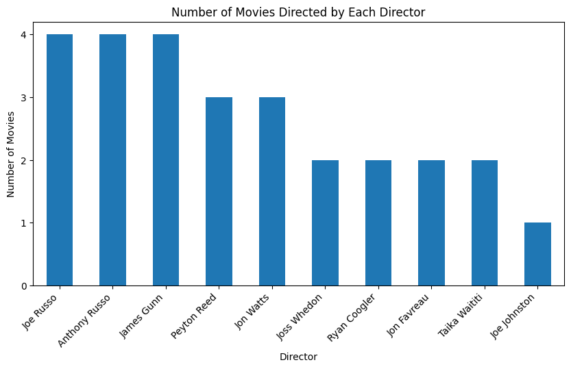
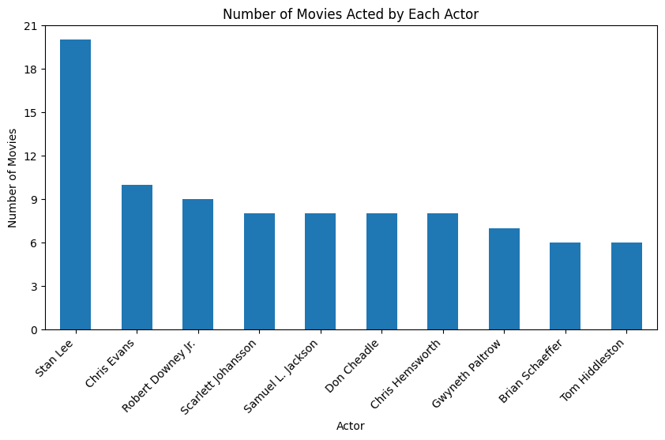
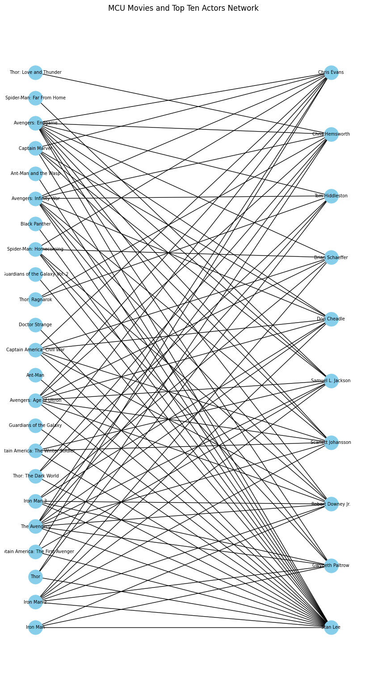

# Marvel Cinematic Universe (MCU) - Wikidata SPARQL Project
This project uses SPARQL to query [Wikidata](https://www.wikidata.org/wiki/Wikidata:Main_Page) and viisualizes the actors/actresses and directors that appear most commonly in [MCU](https://www.wikidata.org/wiki/Q642878) movies.

## Top 10 directors directing most MCU movies
A SPARQL is created to fetch all MCU movies and their corresponding directors before 2025.

A graph is shown below to demonstrate the directors that directed most MCU movies.

## Top 10 actors/actresses acting most MCU movies
A SPARQL is created to fetch all MCU movies and their corresponding actors/actresses before 2025.

A graph is shown below to demonstrate the actors/actresses that directed most MCU movies.

Another graph is shown below to show the networks between top ten actors/actresses and their MCU movies.

